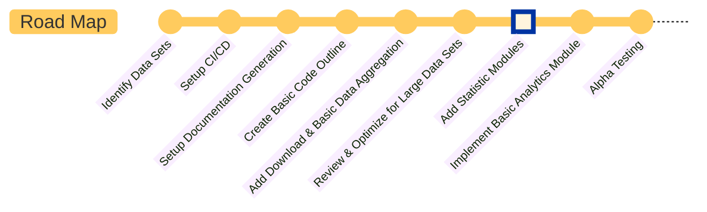

# Overview

This project is an analysis tool designed to perform fundamental analysis on publicly traded equities using a variety of methods. From various studies and research, fundamental analysis is an imperfect science. There's no "silver bullet" that tells you whether a company will be successful or and epic failure.

Likewise it's impossible to predict the future of the stock market by any reasonable measure. Doing so would be a fools errand. However, with enough time and patience, fundamental analysis can help improve your odds by helping to understand the intrinsic value of a company despite the rise and fall of stock prices. Check your emotions at the door and prepare to focus on fundamental analysis.

